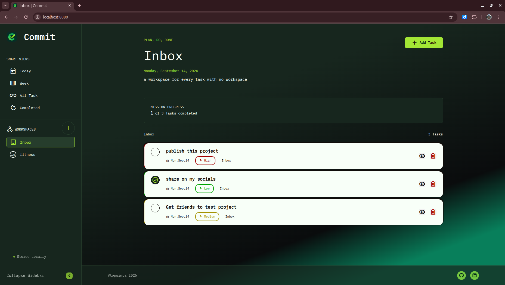

# Project Commit
Commit is a todo list web application, build to help manage and group task.
it mimics traditional todolist. Design for PC and task are stored and manage on browser.
Commit was build as part of requirement of the odin project, 
to help practice OOP and modular design in JS and web application.

## Preview

## Features
- local storage of tasks and workspace
- collapsible sidebar
- tasks takes down todos
- workspace groups tasks together
- CRUD (Create, Retrieve, Update, Delete ) tasks and workspace
- smart views for tasks
- progress bar to help keep track of commitment to tasks

## Objectives
- practice modularity design in web development
- practice Object Oriented Programming in js
- practice SOLID Design Principles.
- practice writing clean JS codes
- practice dynamic content and event handling
- practice using browser local storage and JSON object
- practice using webpack

## Getting Started

### Prerequisites
1. git
2. Node.js

### Installation & Setup
1. Clone this repository:

   \`\`\`sh
   git clone https://github.com/topSimpa/commit
   cd commit
   \`\`\`

2. Install the necessary dependencies:

   \`\`\`sh
   npm install
   \`\`\`

3. Check `package.json` for other available commands.

## Credits & Contributions
- [Myself](https://github.com/topSimpa)

## Technology Used
- Vanilla JS
- HTML5
- CSS
- Webpack, its plugins and loaders
